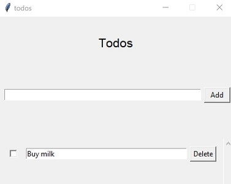

# todos


> simple todo MVC application in plain Python

[Installation](#installation) | [Getting Up And Running](#getting-up-and-running) | [Examples](#examples) | [See Also](#see-also)

todos is a simple todo MVC application in plain Python. Its purpose is: "Learn the MVC pattern by building a small app". Its features are:

- CRUD todos.

The MVC pattern is applied as follows:

- Model: Manages the data of an application.

- View: A visual representation of the model.

- Controller: Links the user and the system.

Finally, this is pretty much a direct port of [Tania Rascia's MVC.js](https://github.com/taniarascia/mvc) to Python using Tkinter.

## Installation

```bash
# FIXME
```

## Getting Up and Running

```bash
nox -l
```

## Examples



## See Also

- [Tania Rascia's MVC.js](https://github.com/taniarascia/mvc)
